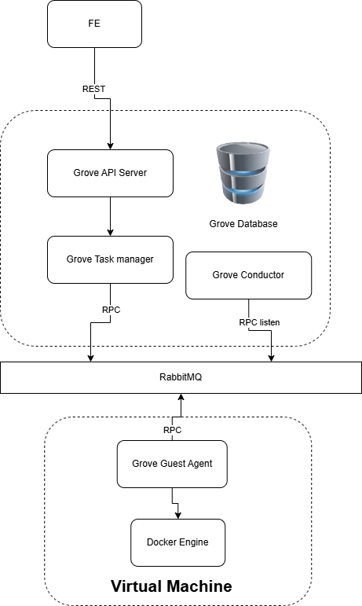

# Grove
- Là phiên bản golang của opensource [trove](https://github.com/openstack/trove)
- Là service khởi tạo nhanh và quản lý các cụm database replication


Kiến trúc ban đầu


# Development
## Chạy test
```bash
go test -v ./...
```